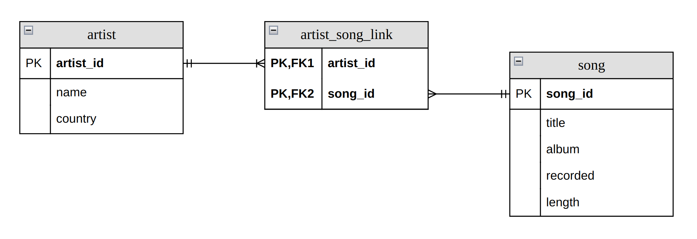

= JDBC

* В нижеприведенных заданиях стоит обратить внимание на *Data Access Layer* (*слой доступа к данным*).
* Вопрос "Как организовать *Presentation Layer*?" остается на усмотрении разработчика. Например: если разработчик знаком с Web компонентами *Jakarta EE*, то можно использовать *Jakarta Servlet* и *JSP*.

== Project 'Music Store'

* Данные для него хранятся в *RDBSM*.
* Структура *Database*:

WARNING: В случае неудачи какого-либо действия, бросить свое собственное исключение.

== Specification of task 1

Реализовать добавление:

* исполнителя
* музыкальной композиции какого-то исполнителя

== Specification of task 2

Реализовать удаление:

* музыкальной композиции какого-то исполнителя
* исполнителя

== Specification of task 3

Реализовать обновление:

* исполнителя
* музыкальной композиции какого-то исполнителя

== Specification of task 4

Реализовать получение:

* исполнителя
* музыкальной композиции какого-то исполнителя

== Specification of task 5

Реализовать получение:

* музыкальной композиции и ее исполнителя
* исполнителя и всех его композиций

== *Specification of task 6

Реализовать получение:

* всех исполнителей с пагинацией
* всех музыкальных композиций с пагинацией
* получение исполнителя и его музыкальных композиций с пагинацией
