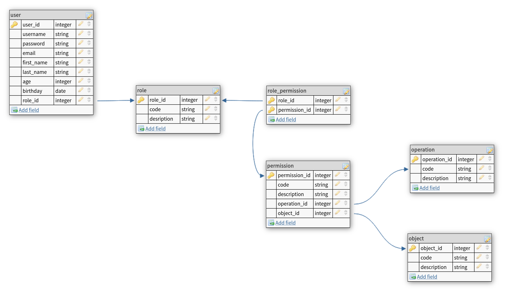

= Query with Criteria

Реализовать приложение "RBAC".

NOTE: *Управление доступом на основе ролей* (англ. *Role Based Access Control*, *RBAC*) — развитие политики избирательного управления доступом, при этом права доступа субъектов системы на объекты группируются с учётом специфики их применения, образуя роли.

.DB schema

== Specification of task 1

* Подключить dependency *Log4J2* - библиотека для _logging_.
* Настроить *Log4J2* с помощью `log4j2.xml` для вывода в Standard Output.

== Specification of task 2

Настроить проект для работы с *Hibernate*. Для этого необходимо:

* Создать maven-проект.
* Подключить зависимости *Driver*, *JPA*, *Hibernate* (одной из реализаций *JPA*).
* Настроить работу *Hibernate* с помощью `hibernate.cfg.xml`.

== Specification of task 3

* Реализовать mapping сущности `UserEntity`
* Реализовать DAO, для этой сущности. Не менее 5 запросов (критерии, которые используются, придумать самостоятельно)
* Протестировать работу DAO

== Specification of task 4

* Реализовать mapping сущности `RoleEntity`
* Добавить в DAO для сущности `UserEntity`. Не менее 2 запросов на JOIN (критерии, которые используются, придумать самостоятельно)
* Протестировать работу DAO
